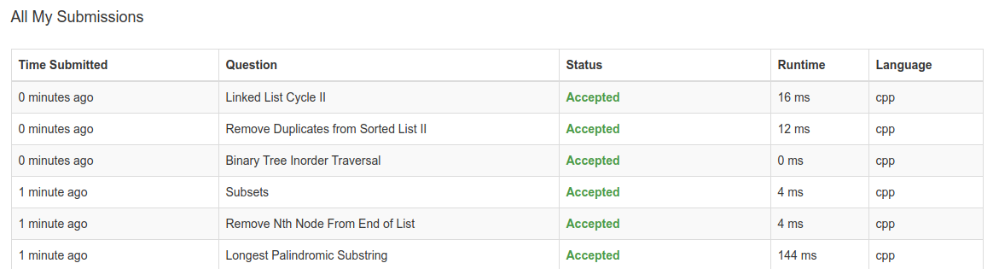

# 刷题群规范

---

## 介绍

群内的小伙伴大家好，欢迎大家加入到刷题群，这个群建立的初衷是让准备找工作需要刷题的人可以聚到一起，相互监督，相互鼓励。

毕竟自己一个人默默刷题往往没有大家相互鼓励，相互追赶效果好。

基于上述原因，我在牛客网发起了一个帖子，希望可以找到一起刷题的人。

## 刷题题库

初步选定了一个比较全面的 leetcode 题库，里面精选了大约 200 道题目：

[CS-Notes-leetcode](https://github.com/CyC2018/CS-Notes/blob/master/notes/Leetcode%20%E9%A2%98%E8%A7%A3%20-%20%E7%9B%AE%E5%BD%95.md)

如果大家有更好的题库，也可以在群里面提出来

## 刷题规范

我初步拟定了一个刷题规范，制定了一个每天刷题数量的目标和刷题时间，如下所示：

> 1. 每天至少刷题 5 道，并进行群内打卡
> 2. 一周保证至少打卡 6 天
> 3. 初步拟定刷题计划从 17 号开始，到 3 月 1 号阶段结束

## 打卡措施

为了规范群内的秩序，并维护群内的群成员质量，避免一些在群内潜水，我写了一个自动群管理机器人监督大家打卡，具体打卡规范如下所示：

##### 1. 打卡形式是 ” 截图+发送打卡消息 “

为了证明的确是提交了至少 5 道题目，请大家在 leetcode 自己的 Submisson 里截图自己最近 5 次不同的 accept 的提交。

例如下面这样：

由于最近的几次提交可能都是同一道题目的，希望大家可以把当天做完的 5 道题目在这时候重新提交一次，这样最近的五次提交都是不同题目的了，这样便于大家互相检阅。

也希望大家有更好的检查措施可以在群里面提出来。

##### 2. 打卡监督措施

为了提醒并监督，以及统计大家的打卡情况，我设置了群内一个自动管理机器人。

机器人支持的反馈发送消息包括：

> 1. 菜单
> 2. 打卡
> 3. 撤回打卡
> 4. 日统计
> 5. 周统计
> 6. 刷题群规则

大家可以在聊天框发送消息即可

支持的自动提醒包括：

> 1. 在每天的上午 10：00 会提醒大家开始刷题了没
> 2. 在每天晚上 9：00 会提醒大家有没有忘记打卡
> 3. 在每天 9：30 会发布当天的打卡统计信息,统计所有打卡同学，以及未打开同学名单。

每周要保证至少 6 天打卡，如果这一周结束，有的小伙伴没有完成，那么将会被请出本群。

群机器人代码已开源，代码个人没有仔细整理，结构有些乱

https://github.com/sunmiaozju/wechat-robot

### 总结

希望大家一起努力，今年都能收获好 offer! o(\*≧▽≦)ツ
